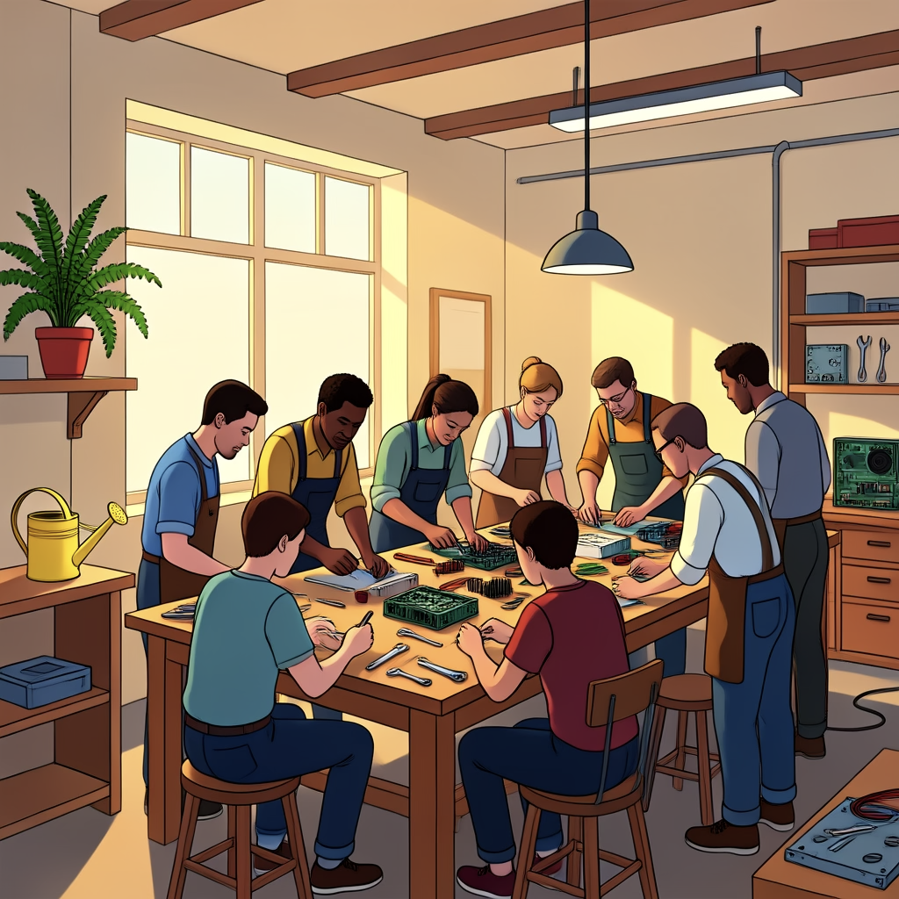
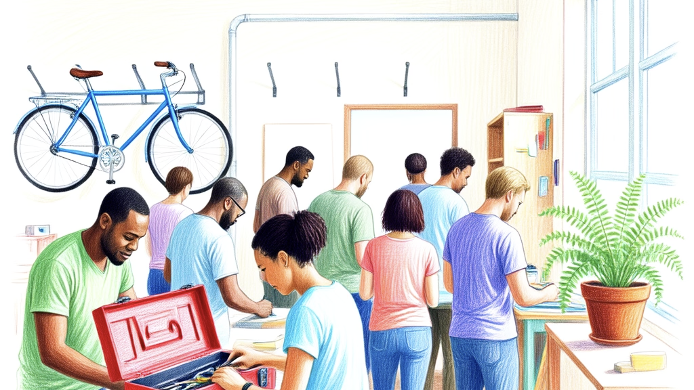

# Apple inside a real gstack conversation

A neighbourhood repair cafe needs a booking website. We discussed its
[initial plan](plan.md) with gstack in Claude Code, then asked Apple to assess
the [resulting plan](recorded/agreed-plan.md) in the same conversation.
These are actual results from 6 September 2026.

gstack identified double-booking, dashboard access, retention and email-failure
issues. Its revised plan saved the booking before attempting confirmation email.

**Ask Apple Cloud:** What consequential gap remains, or is this plan sound?

Cloud identified a resident-facing problem: if confirmation email disappears
into spam, the resident has no proof of booking. It suggested delivery status
and a resend control on the volunteer dashboard.

**Continue with Apple Cloud Pro:** Challenge that recommendation. Can we close
the gap without adding services or confusing “sent” with “delivered”?

Cloud Pro caught the weakness: a successful send does not establish delivery.
Its smaller proposal was to show the booking details and a confirmation code
on the success page. Email becomes an optional reminder. Its suggested test:
disable email entirely and check that the resident still receives correct proof
of booking on screen.

That is a useful contribution to the plan, made inside the existing conversation.
The host can assess and incorporate it; this demonstration did not implement
the website. Details such as collision-safe confirmation identifiers still need
normal implementation judgment. [Full Apple answers and timings](recorded/results.json)
are available beneath the demonstration.

**Then make something for the event.** Claude called Hollis's Illustration
style and returned this image:

We asked for a warmer variation with a yellow watering can, explicitly attaching
that returned image. This was the next result:

It added the requested element but substantially changed the scene. The prompt
also described the scene, so this observation does not establish that the
generator used the attached pixels. Later controls left reliable reference
editing unproven; see [reference evidence](../docs/compatibility.md#image-reference-evidence).
The final host reply supplied a preview and a usable file link.

**The same package in Codex:** Apple Cloud turned the event plan into a short
invitation, followed by a Sketch image with a local 16:9 crop and clickable link.
The invitation contained 35 words rather than the requested 45; the host reported
that limitation and did not silently retry.

| Actual host turn | Elapsed time |
|---|---:|
| gstack engineering plan review | 199.710 s |
| Apple Cloud assessment | 57.907 s |
| Cloud Pro contextual follow-up | 33.307 s |
| Claude illustration | 38.379 s |
| Claude image-reference follow-up | 33.413 s |
| Codex document answer and Sketch | 134.041 s |

Times include host reasoning, tool work and any pacing, not just Apple inference.
Claude Code 2.1.263 used Sonnet; Codex CLI 0.153.4 used GPT-5.6 Sol. Both called
Hollis 0.3.0 on a physical Apple-silicon Mac running macOS 27.0 (26A5425a).
gstack was pinned to `0530392821c277b95e5cd65aa9d9fda4248718b2`.

This is an edited text-and-image record, not a video. Narrative passages summarize
the recorded answers; the JSON retains the two Apple review responses verbatim.
Images are the returned files, without retouching. The fictional fixture was
scripted; gstack's spawned mode selected its non-destructive recommendations,
and other review agents and telemetry were disabled. No upstream endorsement
is implied. Full private event records retain waits and errors.

Testing exposed and fixed the initial missing image-bridge mapping guidance,
a relative-only image reply, and misleading setup-lock errors in sandboxed
readiness checks. [Validation](../docs/validation.md) records those fixes and
the remaining first-time setup acceptance work. [Reproduce the flow](demo.md).
