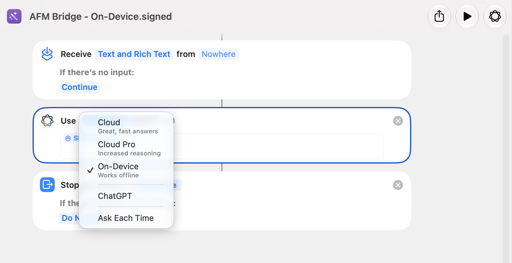

# Two cloud tiers in Shortcuts, none in `fm`

**Measured on macOS 27.0, build `26A5421a`, Apple Silicon (M4 Pro), 2026-09-02.**

Everything below is what this one machine does on this one build. Where a claim
is an inference rather than an observation, it says so.

---

## Summary

On this build the `fm` CLI exposes a single model: `system`, on-device. Private
Cloud Compute is not selectable from it at all.

The Shortcuts **Use Model** action, on the same machine at the same time,
exposes four choices — and two of them are distinct cloud tiers:

| Use Model choice | Apple's own subtitle |
| --- | --- |
| Cloud | Great, fast answers |
| Cloud Pro | Increased reasoning |
| On-Device | Works offline |
| ChatGPT | — |

That two-tier split is the finding. `fm --model pcc`, back when it worked, was a
single generic Private Cloud Compute target with no way to say *which* cloud
model should serve the request. As far as I can find, nobody has documented that
Shortcuts draws the distinction, which makes it a finer-grained model selector
than the `fm` CLI has ever been — including before this build removed PCC from
`fm` entirely.

---

## 1. The picker



The shortcut shown is hollis's own On-Device bridge, so the same image also shows
the whole bridge: **Receive** → **Use Model** → **Stop and Output**. Three
actions, nothing else.

## 2. What `fm` reports on the same machine

```
$ sw_vers
ProductName:     macOS
ProductVersion:  27.0
BuildVersion:    26A5421a

$ fm --help
MODELS
  system        On-device Apple Foundation Model (default)

$ fm available --model pcc
Error: The value 'pcc' is invalid for '--model <model>'. Please provide one of 'system'.
Help:  --model <model>  Model to check: system (default: all)

$ fm available --model system
System model available
```

One model in the list, and `pcc` is rejected by argument validation rather than
failing at runtime — the flag value is simply gone.

## 3. Prior art

The technique of bridging to Apple Intelligence through a Shortcut is **not
new**, and hollis does not claim it.

**Joseph Humfrey, [*The Shortcut to integrating Private Cloud Compute into my
app*](https://joethephish.me/blog/the-shortcut-to-integrating-PCC/), 20 June
2025.** The origin of the approach, fourteen months before hollis:

> there's no public API for Private Cloud Compute … There's no way to integrate
> it into your app, or even use it from the command line. Or is there…?
>
> Here's the twist: **Private Cloud Compute *is* available to users via
> Shortcuts** … it takes the input, passes it to the "Use Model" action with the
> PCC model selected, and returns the result.
>
> macOS ships with a handy command-line tool: `/usr/bin/shortcuts`.

Bridge shortcut, Use Model, `shortcuts run`, capture the output. That is hollis's
transport, described first by him. Note the singular "the PCC model" — on macOS
26 there was one cloud choice.

**[TwoMillionKit](https://github.com/insidegui/TwoMillionKit), July 2026.** Same
goal, different transport: a `LanguageModel` implementation that shells out to
`/usr/bin/fm`, so a Mac app can reach PCC without the entitlement. Its default
model is `pcc`:

```swift
public enum Model: String {
    case privateCloudCompute = "pcc"
    case system
}
// ...
model: Model = .privateCloudCompute,
executableURL: URL(fileURLWithPath: "/usr/bin/fm")
```

**Inference, not an execution test:** its default configuration invokes
`fm --model pcc`, and that invocation is rejected on this build (§2). Its
`.system` path should still work — but on-device access never needed an
entitlement, which is the package's stated purpose. Established from reading the
source and running `fm`; the package itself was not built and run here.

## 4. Why the entitlement matters

Apple's supported route to PCC for third-party code is gated. Per [Apple's PCC
developer page](https://developer.apple.com/private-cloud-compute/) and the
coverage of it, an app needs the Private Cloud Compute entitlement, enrollment in
the App Store Small Business Program, and fewer than two million first-time
downloads; exceeding that ends access, with no paid tier.

On this machine, `PrivateCloudComputeLanguageModel()` compiles and reports
`isAvailable: true`, but a request from an ad-hoc binary with no entitlement
fails with `ModelManagerError 1046`.

This is the reason hollis shells out to `/usr/bin/shortcuts` instead of linking
FoundationModels, and it is worth stating precisely: **the entitlement gates the
developer framework, not the user-facing automation surface.** Shortcuts is a
shipped consumer feature, `shortcuts run` is a
[documented Apple CLI](https://support.apple.com/guide/shortcuts-mac/run-shortcuts-from-the-command-line-apd455c82f02/mac),
and the bridges are shortcuts any user could assemble by hand in under a minute.
Nothing is bypassed, forged, or reverse-engineered; the work runs as the user, on
their machine, under their own Apple Intelligence entitlement.

## 5. The PTY inversion

TwoMillionKit wraps every call in `script(1)`, and its comment explains why:

> PCC's command-line access gate requires a controlling terminal with a nonzero
> window size. Apple's `script(1)` provides the signed process boundary and PTY
> that `fm` expects.

The Shortcuts path has the opposite requirement. A `shortcuts run` attached to a
terminal can silently produce no output at all, which is why hollis always
captures through a pipe (see
[`transport-and-persistence-2026-09-01.md`](transport-and-persistence-2026-09-01.md),
rule 2).

Same class of environment sensitivity, opposite polarity: one path had to fake a
terminal, the other has to make sure there isn't one.

## 6. The predecessor

Hollis is not this author's first pass at the problem. An earlier private tool
put Apple's models behind an HTTP endpoint using `fm serve`, and the entire
model list it could offer was:

```
system / pcc
```

Two models, one cloud tier. Its notes also record that PCC required Terminal.app
as the parent process — the same gate TwoMillionKit works around with
`script(1)`.

That is the dated "before": at its best, the `fm` surface offered one generic
cloud target and no way to choose between cloud models. This build removed even
that, and the Shortcuts surface turns out to expose two.

`fm serve` also occupies port **1976** in Apple's own documented examples, which
is why hollis serves on 1978.

---

## What would falsify this

- Apple restoring `pcc` to `fm` in a later build. That would not affect the
  two-tier claim: `fm --model pcc` still would not distinguish Cloud from Cloud
  Pro.
- A prior public description of the Cloud / Cloud Pro split. The claim here is
  "as far as I can find", not "nobody has found this" — if it has been written up
  before, this section is the one that is wrong.
- The Shortcuts **Use Model** surface changing. It is a surface Apple can alter
  in any build, exactly as it altered `fm` in this one. Every claim here is
  pinned to `26A5421a` for that reason.
